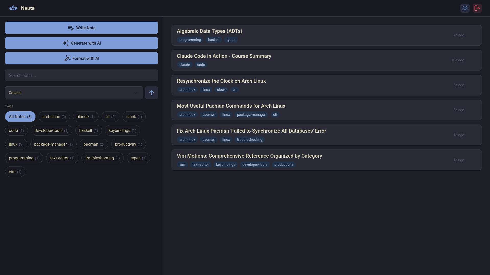

# Naute

A markdown note-taking app with a split-pane editor and live preview — deployed as a serverless app on AWS.



## Features

- 📝 **Split-pane Markdown editor** — CodeMirror editor on the left, live rendered preview on the right
- 🤖 **AI-powered notes** — generate notes from a prompt or format raw text into structured markdown, powered by Claude
- 🔍 **Search, sort & filter** — find notes by title, sort by date or name, filter by tags
- 🏷️ **Tagging system** — organize notes with tags, filter by multiple tags at once
- 🔐 **Cognito authentication** — OAuth 2.0 Authorization Code + PKCE with optional TOTP MFA
- ⚡ **Serverless backend** — Lambda + API Gateway + DynamoDB, zero idle cost
- 🚀 **CI/CD** — GitHub Actions deploys on push to `main` via OIDC
- 🖥️ **CloudFront CDN** — S3-hosted SPA with HTTPS and custom domain

## Tech Stack

| Layer          | Technology                                                     |
| -------------- | -------------------------------------------------------------- |
| Frontend       | React 19, Vite, Tailwind CSS v4, CodeMirror 6                  |
| Markdown       | marked, highlight.js, DOMPurify                                |
| AI             | Claude API (Anthropic SDK), SSM Parameter Store for API key    |
| Backend        | Node.js 22, AWS Lambda (arm64), API Gateway                    |
| Database       | DynamoDB (single-table design)                                 |
| Auth           | Amazon Cognito (OAuth 2.0 + PKCE)                              |
| Infrastructure | AWS SAM, CloudFront, S3, ACM, Route 53                         |
| CI/CD          | GitHub Actions with AWS OIDC                                   |
| Monorepo       | npm workspaces (`shared`, `frontend`, `backend`)               |

## Project Structure

```
naute/
├── shared/        # TypeScript types shared across workspaces
├── frontend/      # React SPA (Vite + Tailwind CSS v4)
├── backend/       # Lambda handlers and DynamoDB data access
└── infra/         # SAM template, deployment config, deploy script
```

## Getting Started

### Prerequisites

- Node.js 22+
- AWS CLI & SAM CLI
- An AWS account with a hosted zone for your domain

### Install

```bash
npm install
```

### Local Development

1. Deploy the infrastructure first (see [Deployment](#deployment)) to get Cognito values.

2. Create `frontend/.env.local`:

   ```
   VITE_API_URL=https://api.yourdomain.com
   VITE_COGNITO_DOMAIN=your-prefix.auth.us-east-1.amazoncognito.com
   VITE_COGNITO_CLIENT_ID=your-client-id
   VITE_REDIRECT_URI=http://localhost:5173/callback
   VITE_LOGOUT_URI=http://localhost:5173
   ```

3. Build and run:

   ```bash
   npm run build -w shared
   npm run dev -w frontend
   ```

   The app will be available at `http://localhost:5173`.

### Build

Build order matters — `shared` must be built before `backend` or `frontend`.

```bash
npm run build -w shared
npm run build -w backend
npm run build -w frontend
```

### Lint

```bash
npm run lint          # check
npm run lint:fix      # auto-fix
```

ESLint with TypeScript ESLint + Prettier.

## Deployment

Set the required environment variables and run the deploy script:

```bash
export NAUTE_DOMAIN=yourdomain.com
export NAUTE_HOSTED_ZONE_ID=Z0123456789
export NAUTE_COGNITO_PREFIX=naute

./infra/deploy.sh
```

The script builds shared and backend, runs `sam deploy`, builds the frontend, syncs to S3, and invalidates CloudFront.

### CI/CD

Pushes to `main` trigger the GitHub Actions workflow which deploys automatically using OIDC for AWS authentication. Configure the following repository secrets:

- `AWS_ROLE_ARN` — IAM role ARN for GitHub OIDC
- `NAUTE_DOMAIN` — custom domain
- `NAUTE_HOSTED_ZONE_ID` — Route 53 hosted zone ID
- `NAUTE_COGNITO_PREFIX` — Cognito hosted UI domain prefix
- `VITE_API_URL` — API endpoint URL
- `VITE_COGNITO_DOMAIN` — Cognito domain
- `VITE_COGNITO_CLIENT_ID` — Cognito client ID
- `VITE_REDIRECT_URI` — OAuth callback URL
- `VITE_LOGOUT_URI` — post-logout redirect URL

## API

All routes are authenticated via Cognito JWT.

| Method   | Path              | Description                                   |
| -------- | ----------------- | --------------------------------------------- |
| `GET`    | `/notes`          | List all notes                                |
| `POST`   | `/notes/create`   | Create a note                                 |
| `GET`    | `/notes/{id}`     | Get a note                                    |
| `PUT`    | `/notes/{id}`     | Update a note                                 |
| `DELETE` | `/notes/{id}`     | Delete a note                                 |
| `POST`   | `/notes/generate` | Generate or format a note via AI (SSE stream) |

### Validation

- Title: required, max 200 characters
- Content: max 100 KB
- Tags: 1–20 tags, each max 50 characters, pattern `^[a-z0-9-]+$`
